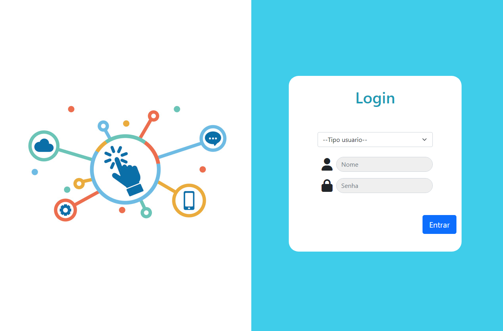

# HelpDesk - Site de Chamados 
Um site de chamados helpdesk para gerenciar solicitações de suporte e tickets de problemas.

  

## Arquitetura MVC (Model-View-Controller)
A arquitetura MVC separa claramente as responsabilidades de uma aplicação, o que torna o código mais organizado, modular e fácil de entender e manter. Isso facilita a escalabilidade da aplicação, permitindo que diferentes partes dela sejam modificadas, substituídas ou estendidas sem afetar outras partes.
1. Model (Modelo) Ele é responsável por acessar e manipular os dados do aplicativo, bem como realizar operações relacionadas à lógica de negócios
2. View (Visualização) Ela exibe os dados que são fornecidos pelo Modelo e geralmente é a camada que os usuários interagem diretamente.
3. Controller (Controlador) Ele recebe as entradas do usuário, processa essas entradas (normalmente por meio de interações com o Modelo) e atualiza a View conforme necessário.

## Funcionalidades 
1. login de usuários
2. Criação de chamados . 
3. Consulta de chamados de acordo com o seu nível e ocorrência. 

## Banco de Dados - MySQL
O MySQL é um sistema de gerenciamento de banco de dados relacional (SGBDR) de código aberto amplamente utilizado em todo o mundo. Ele oferece uma plataforma confiável e escalável para armazenar e gerenciar dados em uma variedade de aplicativos, desde sites simples até sistemas corporativos complexos.
1. O MySQL utiliza a linguagem SQL para realizar operações de consulta, inserção, atualização e exclusão de dados.
2. O SQL é uma linguagem padronizada que oferece uma sintaxe comum para interagir com bancos de dados relacionais.

## PHP (Hypertext Preprocessor)
Ela é especialmente adequada para a criação de sites dinâmicos e interativos, pois permite que você processe dados, interaja com bancos de dados.
1. Uma das principais características do PHP é sua capacidade de integrar-se facilmente com HTML. Você pode incorporar código PHP diretamente em um documento HTML, geralmente entre as tags <?php e ?>.

# Environment
1. Intale o docker. [Visite docker.com]("https://www.docker.com/products/docker-desktop/)
2. Baixe o arquivo docker-compose.yml.
3. Crie uma pasta na area de trabalho.
4. Copia o endereço da pasta.
5. Abra o arquivo YML e na linha 10 substitua PAHT pelo caminha da pasta que foi criada.
6. Salve o arquivo.
7. Vá até o diretorio onde esta o arquivo YML clique da barra de navegação e digite CMD.
8. Na CLI digite: docker compose up -d.
9. Salve os arquivos do repositório dentro da pasta criada na area de trabalho.
10. Pronto. Agora basta acessar o localhost através do navegador de acordo com os arquivos.

## Tecnologias Usadas 

  
  
  
  
    

